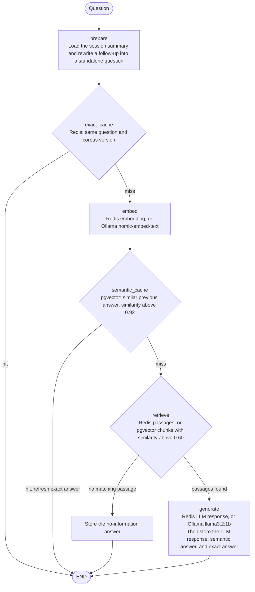

# RAG Cache

Local retrieval-augmented chat with a cache at each expensive step. Admins upload documents. Users register, log in, and continue their own chats later. Answers are returned only from uploaded documents.

## Ask graph

A question enters the LangGraph at `prepare` and stops at the first cache that can answer it. A miss falls through to the next node. `generate` always stores the exact answer in Redis before the graph ends. After the graph returns, the chat session saves both messages in PostgreSQL and summarizes older turns once the session reaches 20 messages.



| Node | On a hit | On a miss |
|---|---|---|
| `prepare` | Always continues. Uses the summary only to resolve follow-ups. | |
| `exact_cache` | Return the stored answer and sources. | Embed the question. |
| `embed` | Reuse the query vector from Redis. | Call `nomic-embed-text` and store the vector. |
| `semantic_cache` | Return the previous answer and copy it into the exact answer cache. | Search passages. |
| `retrieve` | Reuse the ranked passages from Redis. | Search active chunks in pgvector. No chunk above 0.60 ends the graph with the no-information reply. |
| `generate` | Reuse the completion from Redis. | Call `llama3.2:1b` with temperature 0. A grounded answer is also saved in the semantic cache. |

## Stack

- Streamlit chat and admin upload pages
- LangGraph ask flow
- LangChain Ollama chat and embeddings, plus the text splitter
- LangSmith tracing when `LANGSMITH_TRACING=true` and an API key are set
- Ollama `nomic-embed-text` for embeddings and `llama3.2:1b` for chat
- Redis for exact answer, query embedding, retrieval, and LLM response caches
- PostgreSQL 15 with pgvector for chunk embeddings, the semantic answer cache, users, and long-term chat sessions

## Cache layers

1. Exact answer in Redis for the same normalized question and corpus version.
2. Query embedding in Redis, keyed by the embedding model and text hash.
3. Semantic answer in pgvector when a previous question is very close (default cosine similarity above 0.92) and the corpus version matches.
4. Retrieval in Redis for the ranked passages.
5. LLM response in Redis for the same question and passage hashes. Generation uses temperature 0.

Uploading or replacing a document increments the corpus version, so answer and retrieval keys from the previous corpus are left unused.

## Incremental document versions

Upload the same file name again to create the next document version. Each passage is hashed. Passages whose text is unchanged reuse the stored embedding. Only new or edited passages are sent to `nomic-embed-text`. If the file bytes and the passage metadata are unchanged, no new version is written.

Chunk metadata keeps the document name, version, section, page number, and source-specific fields such as the Excel sheet and row range. Chat answers include that metadata as the source. Passages at or below similarity 0.60 are ignored. When nothing qualifies, the reply is:

`I dont have information about quesry, please provide more information.`

## Chat memory

Chat sessions and messages are stored in PostgreSQL. A user logs in again to load that history. After 20 messages, older turns are summarized into the session's long-term memory. The full transcript remains visible. The model uses the summary plus the latest turns only to resolve follow-up questions, then answers from retrieved passages.

## Setup

PostgreSQL 15 with pgvector, Redis on `localhost:6379`, and Ollama with these models:

```powershell
ollama pull nomic-embed-text
ollama pull llama3.2:1b
```

Image and scanned-PDF text use Tesseract OCR when `tesseract` is on PATH. The other file types do not need it.

```powershell
python -m venv .venv
.\.venv\Scripts\Activate.ps1
pip install -r requirements.txt
copy .env.example .env
```

Edit `.env`:

- `DATABASE_URL` for your local PostgreSQL 15 user and password. On this machine PostgreSQL 15 listens on port `5433` (PostgreSQL 13 is on `5432`). The `rag_cache` database is created if it is missing. If the password contains `@`, `:`, or `/`, URL-encode it. `ADMIN_PASSWORD` is applied only when that admin username does not exist yet.
- `ADMIN_PASSWORD` to anything other than `change-me`. On startup the app creates the admin user from `ADMIN_USERNAME` when that user does not exist yet.

```powershell
streamlit run app.py
```

Open the local URL Streamlit prints. Register a user for chat, and sign in as the admin to upload PDF, Word, Excel, PowerPoint, text, HTML, or image files.

Set `LANGSMITH_TRACING=true`, `LANGSMITH_API_KEY`, and `LANGSMITH_PROJECT` when you want traces. EU accounts use `LANGSMITH_ENDPOINT=https://eu.api.smith.langchain.com`. Restart Streamlit after `.env` changes.

```powershell
python -m unittest discover -s tests -v
```
